# Pre-Requisites

## Installing git

### Windows

Go to [this link](https://git-scm.com/download/win). Follow the instructions to install git bash.

1. Accept the terms and conditions
2. Install Git Bash and Git GUI
3. Select your preferred text editor
3. Select "Use Git from Git Bash only"
4. Select "Use the OpenSSL library"
4. Select "Checkout windows style, commit unix style line endings"
4. Select "Use Windows default console window"
4. Select the first two extra options

### Linux

You know what you're doing.

#### Debian, Ubuntu, Mint and other Debian based distros

> sudo apt install git

#### Arch Linux, Manjaro and Arch based distros

You probably already have this.
> sudo pacman -S git

#### Fedora, RHEL and Red hat distros

Why are you even here?
> sudo dnf install git

## Create a github account

Go to [github](https://github.com) and make an account if you don't already have one.

# The Session

### The Local Repository

The first step in using a version control system is making the actual
repository. Here, I've made a directory named 'foss-lab' and converted
it into a git repo by using `git init` inside the directory. This creates
a `.git` directory inside the repo, which store the details about the git
version control system. This directory is our local repository. I've
also made a README.md file.  

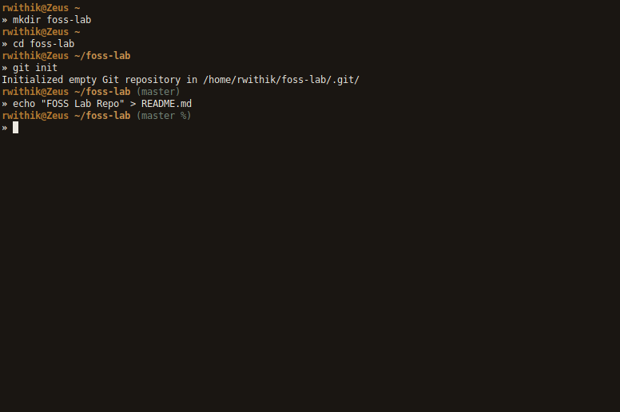

### The Remote Repository

The local repository exists only on my system. We need to connect it to
a remote repository, for any sort of collaboration to be possible. So, I
made an online repo at github.com. 

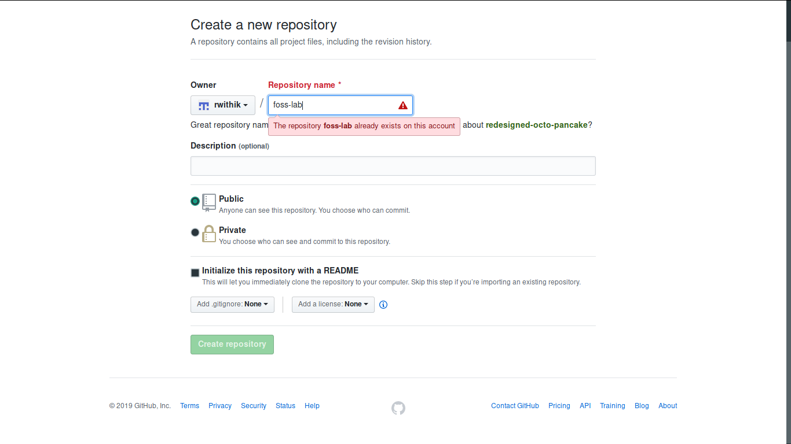

Now we need to connect the local repo to the online repo. This is done
using the `git remote` command. 

Syntax:
> git remote add origin \[URL\]

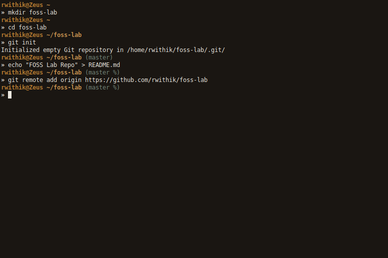

### Making Changes

Any new files or any changes in existing files should be added to the
local and remote repositories. This is done with the `git add` command.
This add the modified and new files to the staging area. Then the files
are committed with a commit message using `git commit`. This records the
changes in the local repo.

Syntax: 
> git add \[FILE(S)\] 

> git commit -m
\"MESSAGE\" 

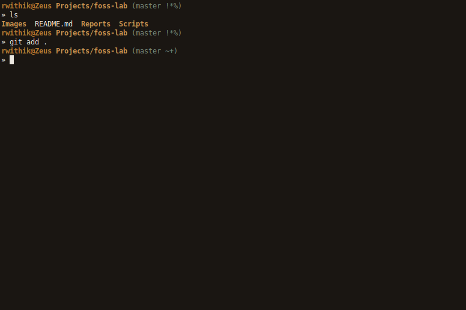 

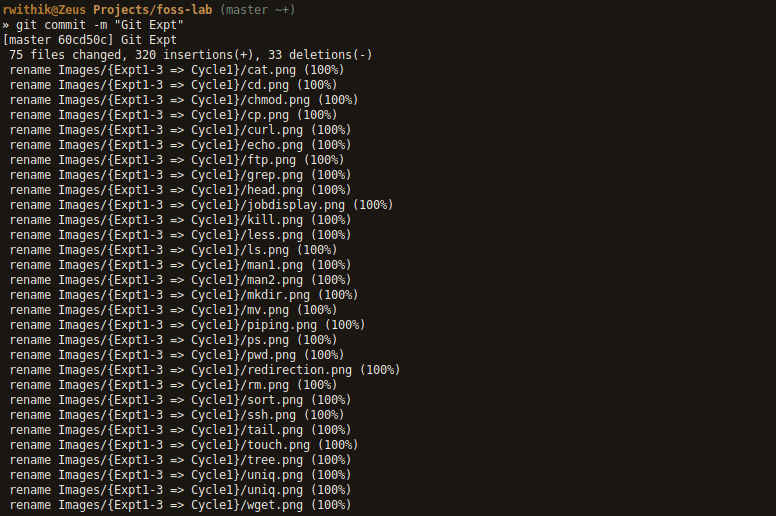

### Setting Up Your Account

Among the first things you should do when you install Git is to set your user name and email address. This is important because every Git commit uses this information, and it’s immutably baked into the commits you start creating:

> $ git config --global user.name "YourUserNameHere"
  
  And then
  
> $ git config --global user.email YourEmailHere

This will add the credentials to the config file stored locally, and will prompt you to login to the GitHub Id, you just provided.

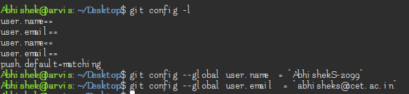

### Pushing Changes to the Remote Repository

The changes we committed are currently recorded in the local repository.
To push these changes to the remote repo, use `git push`. In the example
given below, origin is the name of the remote, and master is the name of
the branch.

Syntax: 
> git push \[REMOTE NAME\] \[BRANCH NAME\]

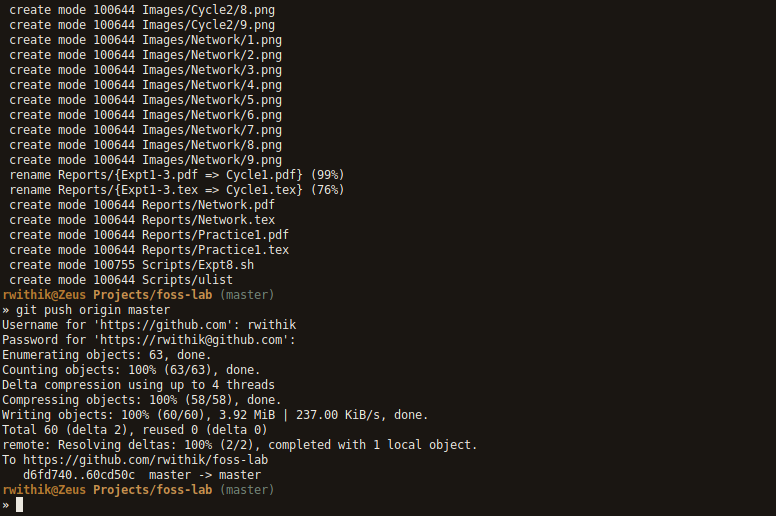

### Comparing Previous Versions

Use the `git log` command to see all the previous changes with their commit messages. 

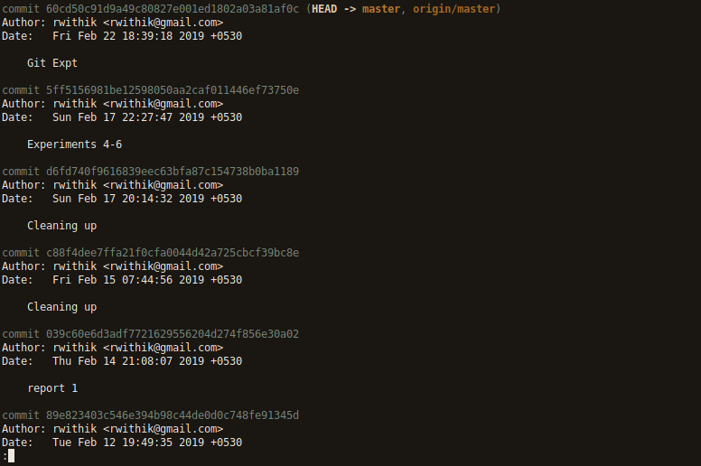 

Use `git checkout` to revert to a previous state of the repo. 

Syntax: 
> git checkout \[BRANCH\]

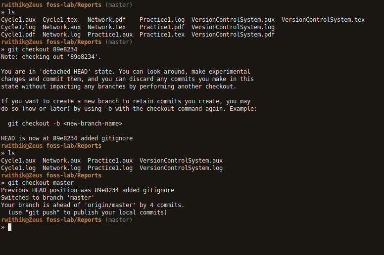

### Merge Conflicts

The `git pull` command is used to update the local repo when it is behind
the remote repo. Automatic merges of changed files occur normally, but
in cases where the same lines are changed in both the repos, a merge
conflict occurs. It can be resolved by editing the conflicted files and
choosing which change to keep. 

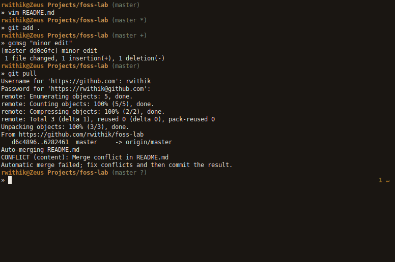

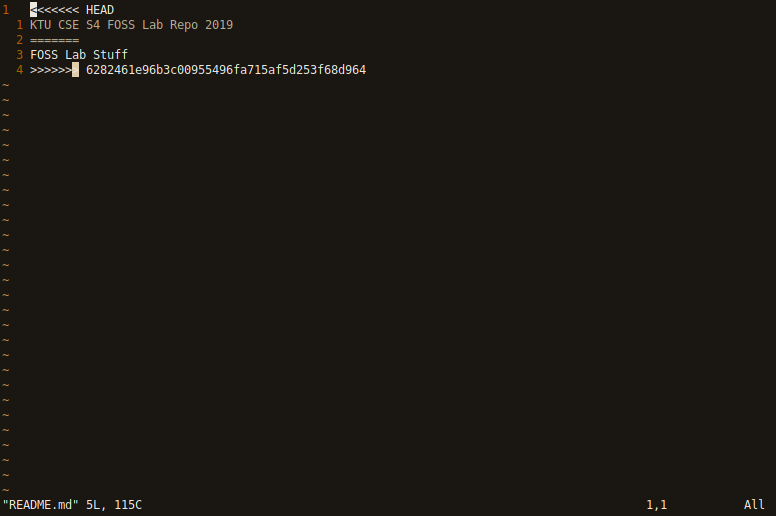 

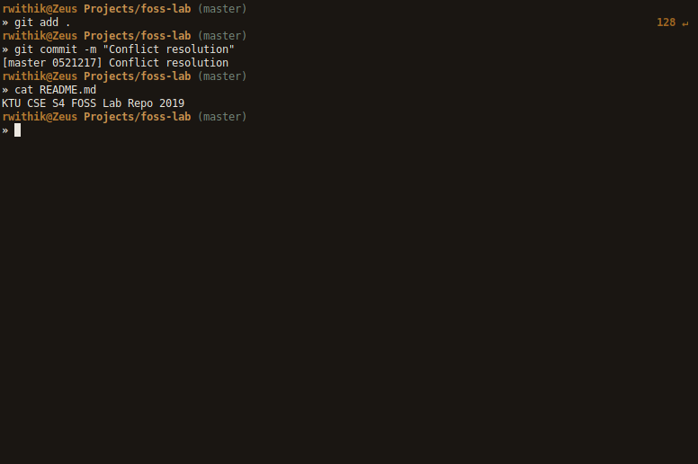

### References 
Intersted in learning more about git , check out the following  
[Official Documentation](https://guides.github.com/introduction/git-handbook/)  
[Github Cheat Sheet](https://education.github.com/git-cheat-sheet-education.pdf)  
[Atlassian Git Tutorial](https://www.atlassian.com/git/tutorials)  
Interested in doing interactive learning through git visualization, then check out [Learngitbranching](https://learngitbranching.js.org/)

